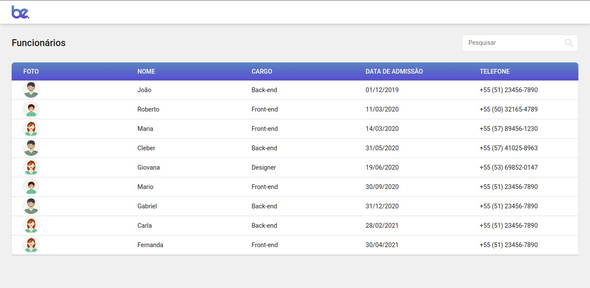
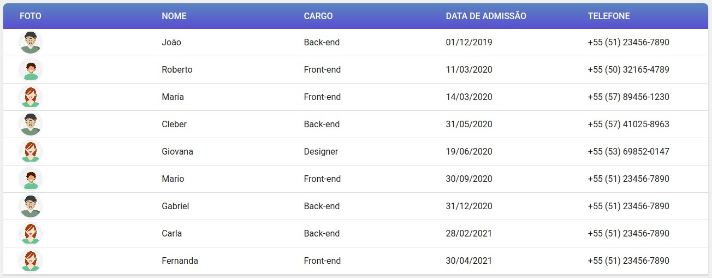
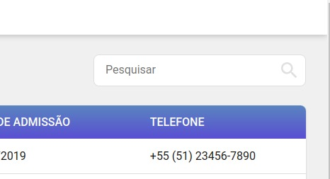
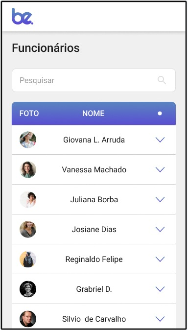
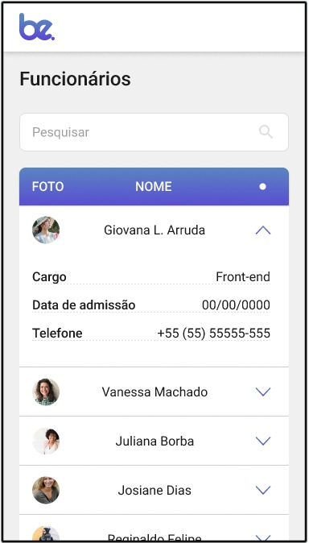

# Desafio BeMobile Front End
A aplicação frontend é construída com React, utilizando Vite como ferramenta de desenvolvimento e TypeScript para tipagem estática. Renderiza os dados de uma API JSON, apresentando informações detalhadas sobre os funcionários da empresa de forma organizada e acessível aos usuários. Possuindo um campo de busca para pesquisa de dados filtrados.

# Versão Demo - Deploy 
[Link do projeto](https://projeto-be-mobile-desafio-front-end.vercel.app/)

# Como funciona?
Este projeto é uma aplicação front-end desenvolvida em React com Vite, destinada a exibir e gerenciar informações de funcionários. A aplicação apresenta uma tabela dinâmica de funcionários com opção de busca eficiente, permitindo aos usuários filtrar sua busca inserindo dados específicos no campo de busca, como nome, cargo ou número de telefone, proporcionando uma experiência de usuário personalizada. Além disso, a aplicação é responsiva, adaptando-se de forma fluida tanto para dispositivos web quanto móveis, garantindo uma experiência consistente em todas as plataformas.

#### Tela Principal - Tabela de Funcionários
- Apresenta os dados de todos os funcionários disponíveis no banco;
- Caso uma busca filtrada seja executada, a tabela exibe somente o resultado relacionado;
- Em caso de falha na busca de dados, é exibido um alerta informando o erro para o usuário;
- Os dados exibidos são: Nome, Cargo, Foto de Perfil, Data de Admissão e Número de Telefone;

#### Campo de Pesquisa - Busca Filtrada
- Possui um input para busca de nome, cargo ou telefone, para serem enviados para API e renderizados na tabela;
- Em caso de sucesso, o usuário recebe uma busca filtrada com os dados relacionados a pesquisa;
- Em caso de falha é exibido um alerta informando o erro para o usuário;
- Se a busca for feita com o campo de pesquisa vazio um alerta informa o erro para o usuário.

#### Versão Mobile

# Motivação 

Minha motivação foi desenvolver uma tabela de dados eficiente que exibe informações dinâmicas dos funcionários, permitindo uma busca filtrada para melhorar a experiência do usuário. Isso não apenas torna a aplicação mais eficiente, mas também oferece uma interação intuitiva e facilita a localização rápida de informações relevantes, contribuindo para uma experiência de usuário mais satisfatória.

# Tecnologias Utilizadas
Para este projeto foram utilizadas:

  - React;
  - Vite;
  - Axios;
  - Eslint;
  - Styled Components;
  - Dayjs;
  - Sweet Alerts;
  - Type Script;
  - React Router.

# Como rodar em desenvolvimento
Para executar este projeto em desenvolvimento é necessário seguir os passos abaixo:

- Clonar o repositório ;
- Baixar as dependências necessárias com o comando: npm install;
- Para rodar o projeto em desenvolvimento, execute o comando npm run dev.

# Como Obter os dados da API Json Server
Para acessar os dados dinâmicos, realizei o deploy da API que compartilha as informações dos funcionário:

- Crie um arquivo .env na pasta raiz do seu projeto;
- Crie uma variável de ambiente e adicione o link do deploy da API:   VITE_API_URL= (link do deploy)
- Como no exemplo, adicione o seguinte link do local informado: https://json-api-alpha-dun.vercel.app/

